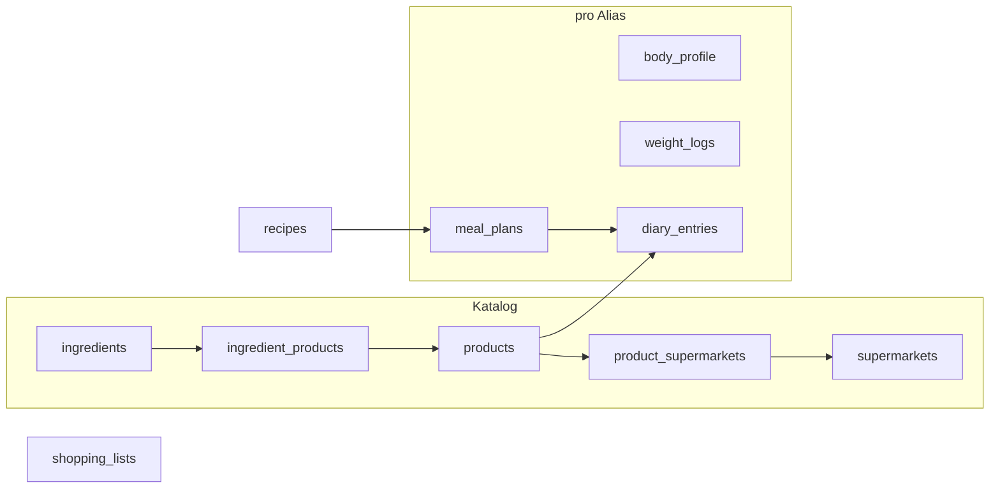

# Kalorien- und Nährwerttracker

## Kontext

Heute liegen Nährwerte nur grob am Rezept ([`NutritionData`](src/types/recipe.ts) / [`src/lib/nutrition.ts`](src/lib/nutrition.ts)). Zutaten sind Namens-Autocomplete ohne Nährwerte ([`ingredients`](src/lib/database.ts)-Tabelle). Die Startseite ist eine Willkommensseite ([`src/pages/index.astro`](src/pages/index.astro)); Personalisierung hängt am Alias ([`AliasSettingsModal.astro`](src/components/modals/AliasSettingsModal.astro)), nicht an einem Login.

Entscheidungen aus der Rückfrage:
- Ein Alias = eine Person (Tracker, Gewicht, Ziel am Alias).
- Geplante Mahlzeiten erscheinen am Tag, zählen aber erst nach Bestätigung „Gegessen“.
- Erinnerungen per PWA-Notification (Windows/Android priorisiert) — **nur Best-Effort, solange die PWA offen oder kürzlich aktiv ist** (kein Push-Server im ersten Wurf).

## Öffentliche EAN-API

Es gibt **keine vollständige globale EAN-Pflichtregister-API** (GS1/GEPIR ist firmenspezifisch und nicht frei für Nährwerte). Für Lebensmittel ist [Open Food Facts](https://world.openfoodfacts.org/) die passende freie Quelle: Crowdsourcing-Datenbank, Lookup per Barcode ohne API-Key, Nährwerte pro 100 g, Marke, Menge, Bilder ([OFF-API-Doku](https://openfoodfacts.github.io/documentation/docs/Product-Opener/api/tutorial-off-api)).

**API-Version:** OFF führt **API v3 als current**, **v2 als deprecated**. Lookup geht über v3, z. B. `GET https://world.openfoodfacts.org/api/v3/product/{ean}` (User-Agent Pflicht; optional `de.openfoodfacts.org`). v2 nicht als Primärpfad. Falls v3 für einzelne Felder anders strukturiert ist als die bisherigen v2-Beispiele, Mapping in einem Adapter (`src/lib/openFoodFacts.ts`) isolieren.

Einbindung:
- Server-Proxy `GET /api/products/lookup?ean=…` gegen OFF v3.
- Treffer in das lokale Produktregister übernehmen (editierbar, nicht nur Cache).
- Namenssuche optional über OFF Search.
- Hinweis in der UI: Daten unvollständig/community-basiert, Lizenz ODbL, Attribution.

## Datenmodell

Nährwerte von Zutaten/Produkten immer **pro 100 g** (LMIV/OFF).

### Gramm-Umrechnung (größtes technisches Risiko)

[`src/lib/units.ts`](src/lib/units.ts) rechnet **nicht** alles nach Gramm oder ml:
- Gewicht (`g`/`kg`) konvertiert nach g — das ist der einfache Fall.
- Volumen: `ml` und `l` hängen zusammen, aber **TL, EL, Tasse sind eigene `isBaseUnit: true`** und konvertieren bewusst **nicht** nach ml (EL/TL-Reparatur-Migration). `densityGPerMl` allein reicht für „1 EL Öl“ nicht.
- `natural` (Zehe, Bund, Kopf, …) und `small` (Prise, Msp., Spritzer) haben **keinen** Gramm-Bezug. Eine einzelne Spalte `grams_per_piece` ist zu grob (Zehe ≠ Kopf).

Deshalb **keine** einzelne `grams_per_piece`-Spalte. Pro Katalog-Zutat eine Map **`gramsByUnit: Record<string, number>`** (kanonischer Einheitsname → Gramm). Das ist auch der Weg für **Stückzutaten** (Zwiebel, Knoblauchzehe, Kohl): ein **Default-Stückgewicht** (z. B. `gramsByUnit['Stück'] = 110`, `gramsByUnit['Zehe'] = 5`) macht sie rechenbar, bleibt aber eine **Schätzung** → Ergebnis wird als geschätzt markiert (siehe Tilde unten). Nährwerte bleiben immer pro 100 g; eine separate „Nährwerte pro Stück“-Eingabe gibt es bewusst nicht (Doppelpflege, und das Stückgewicht braucht die Preisrechnung ohnehin).

Auflösung in `recipeNutrition.ts` liefert pro Zutat `{ grams: number | null, isEstimated: boolean }`:

1. Menge in die kanonische Einheit aus `units.ts` bringen (nur echte Child-Units, z. B. kg→g, l→ml, Becher→Tasse).
2. Wenn die Einheit nach **g** konvertiert: Ergebnis ist schon Gramm → **exakt** (`isEstimated: false`).
3. Sonst wenn `gramsByUnit[unit]` gesetzt (Stück/natural/Tasse/…): `menge * gramsByUnit[unit]` → **geschätzt** (`isEstimated: true`, Default-Stückgewicht ist ein Schätzwert).
4. Sonst wenn die Einheit nach **ml** konvertiert **oder** ein bekanntes ml-Äquivalent hat (siehe Defaults): `ml * densityGPerMl` → **geschätzt** (`isEstimated: true`).
5. Sonst: `grams: null` → Zutat zählt nicht, UI-Warnung „unvollständig“ mit konkreter Einheit.

**Defaults in Phase 1 ziehen** (sonst rechnet fast nichts):
- Globale ml-Äquivalente (nicht in `units.ts` als baseUnit, nur für Nutrition): TL ≈ 5 ml, EL ≈ 15 ml, Tasse ≈ 250 ml.
- Dichte-Defaults nach Zutatenname/Alias wo sinnvoll (Wasser 1, Milch ~1,03, Öl ~0,91, …) als startbare `gramsByUnit`/`densityGPerMl`-Vorschläge, überschreibbar.
- Stück/natural: nur rechnen, wenn die Zutat ein Default-Stückgewicht in `gramsByUnit` hat (z. B. `Stück`, `Zehe`, `Kopf`).

Damit gibt es **drei** Zustände statt zwei: **exakt**, **geschätzt (~)**, **unvollständig (fehlt ganz)**. „Unvollständig“ ist am Anfang der Normalfall; die Warnung listet welche Zutaten/Einheiten fehlen.

### Tabellen

- `ingredients`: `nutrition_json` (pro 100 g), `density_g_per_ml`, **`grams_by_unit_json`** (Map unit→g). Kein einzelnes `grams_per_piece`.
- `supermarkets`: id, name.
- `products`: id, ean (unique, nullable), name, brand, net_grams, package_label, nutrition_json (pro 100 g), default_price, image_url, source (`manual` | `openfoodfacts`), off_code.
- `ingredient_products`: Junction Zutat↔Produkt, `is_default`.
- `product_supermarkets`: Junction Produkt↔Markt, `price`.
- `meal_plans`: alias, recipe_id, scheduled_at, servings, supermarket_id?, status (`planned` | `eaten` | `skipped`), product_assignments JSON `{ recipeIngredientId: productId }`, reminder_minutes?, nutrition_snapshot nach „Gegessen“.
- `diary_entries`: alias, eaten_at, source (`plan` | `recipe` | `product` | `free`), Verweise, grams/servings, **Nutrition-Snapshot** (Historie bleibt stabil).
- `weight_logs`: alias, logged_at, weight_kg.
- Körperprofil in `alias_settings` (Key z. B. `cookbook.tracker.profile`): Größe, Geschlecht, **Alter**, **Aktivitätsfaktor**, Ziel-kg/Woche, Zielgewicht. Aktuelles Gewicht = letzter `weight_logs`-Eintrag.

Einkaufsliste: `shopping_lists.preferred_supermarket_id`; Items um `productId` und `estimatedPrice` erweitern (JSON, wie bisher).

### Schema-Migration: EXPECTED_SCHEMA reicht nicht

[`scripts/migrate-db.js`](scripts/migrate-db.js) `createTable`/`addColumn` kann Spalten und einen zusammengesetzten PK anlegen, **aber keine Foreign Keys, keine Indizes, kein Mehrspalten-UNIQUE**. Junction-Tabellen (`ingredient_products`, `product_supermarkets`) sind lookup-lastig.

Phase 1 deshalb **wie `recipe_drafts`**: volles `CREATE TABLE IF NOT EXISTS` inkl. UNIQUE und Indizes in [`database.ts` `initTables()`](src/lib/database.ts) **und** in `performDataMigrations`. `EXPECTED_SCHEMA` nur für grobe Spaltenpräsenz; Integrität/Performance nicht dem generischen Migrator überlassen.

## Produkt-Sichtbarkeit: eigene Achse, nicht `visibleWhen`

`visibleWhen` / [`isVisibleWhenSatisfied`](src/lib/alternatives.ts) hängt an der `optionToGroup`-Map und der Alternativen-Fixpunkt-Iteration. Consumer sind **server-seitig** Einkaufsliste, Kochmodus, `filterRecipeBySelection` in [`database.ts`](src/lib/database.ts). Produktwahl ist **Laufzeit-Ansichtszustand**, keine gespeicherte Alternative.

**Nicht** `productIds` in `VisibilityCondition` mischen — das würde jeden Consumer um eine zweite Dimension erweitern und die Fixpunkt-Logik vermischen.

Stattdessen ein **zweites, optionales Feld** am Node, z. B. `visibleWhenProducts?: { productIds: string[] }` (oder `visibleWhenProductIds: string[]`). Auswertung:

- Alternativen unverändert in `alternatives.ts` (Einkauf, Kochen, Filter bleiben wie heute).
- Produkt-Sichtbarkeit nur wo es eine Produktauswahl gibt: Rezeptansicht (Client), Meal-Plan-Snapshot, berechnete Nährwerte/Preise in der Ansicht.
- Anwendung **nach** `isNodeVisible` / Alternativenfilter: `isProductVisible(node, productSelection)`.
- Kochmodus/Einkaufsliste ohne Produktauswahl ignorieren das Feld (Node bleibt sichtbar, sofern Alternativen es erlauben) — oder bekommen optional später dieselbe Map, ohne `alternatives.ts` anzufassen.

Edit-UI: zweites „Nur anzeigen wenn Produkt …“ neben dem bestehenden Alternativen-Dropdown ([`GroupDependencyControl.astro`](src/components/recipe/edit/GroupDependencyControl.astro)), nicht dasselbe Select.

## Berechnung

- **Rezeptnährwerte (live) in `recipeNutrition.ts`:** Zuerst **absolute Summe fürs ganze Rezept** (sichtbare Zutaten, Menge → g → `g/100 * nutrition100g`). Produkt schlägt Default der Zutat. **Danach durch `servings` teilen** (bzw. aktuelle Portionswahl in der Ansicht), damit das Ergebnis dasselbe **pro Portion**-`NutritionData` ist wie [`NutritionInfo.astro`](src/components/recipe/details/NutritionInfo.astro) und `metadata.nutrition`. Ohne diese Division wäre der klassische Faktor-Fehler (ganzes Rezept vs. Portion). Tagebuch-/Plan-Snapshots speichern die **Portionswerte × tatsächlich gegessene Portionen** (oder explizit grams + per-portion, aber eine Variante konsequent).
- **Geschätzt-Kennzeichnung (Tilde):** hängt an **„geschätzt"**, nicht an „Stück". Der Rechner reicht `isEstimated` pro Zutat durch (Schritt 3/4 oben: Default-Stückgewicht oder Dichte). Die **Rezeptsumme ist `~`, sobald irgendeine einfließende Zutat geschätzt wurde**; sonst exakt. `~` also z. B. bei „2 Zwiebeln" (Stückgewicht) oder „1 EL Öl" (Dichte), **kein** `~` bei „200 g Mehl" + Nährwerte pro 100 g. Anzeige: `~` vor dem Wert plus Legende „~ = geschätzt".
- Manuelles `metadata.nutrition` bleibt Fallback, wenn nichts berechenbar ist; UI kennzeichnet Quelle (berechnet vs. Rezeptangabe) und listet unvollständige Zutaten.
- **Preis:** analog erst Rezept-total (`grams / net_grams * supermarketPrice ?? defaultPrice`), Anzeige optional pro Portion. Einkaufsliste: Position = konkrete Menge, plus Summe pro Rezept und Gesamt.
- **Kalorienziel:** BMR (Mifflin-St Jeor) × Aktivität ± (kg/Woche × 7700 / 7). Empfohlene Makros daraus (Protein g/kg, Fett ~30 % kcal, KH Rest; Ballaststoffe/Salz als Fixziele).
- **Tagebuch:** Tagesringe = Summe der Snapshots mit Status gegessen.

## UX-Flüsse

**Startseite** (`/`): ohne Alias wie bisher plus Hinweis. Mit Alias: Tracker-Zentrale (heutige kcal/Makros vs. Ziel, geplante Mahlzeiten mit „Gegessen“, Tagebuch, Gewichtskurve, Quick-Add inkl. Scan). Navigation in [`Layout.astro`](src/layouts/Layout.astro): Tracker, Produkte.

**Zutaten-Seite:** Default-Nährwerte (pro 100 g), Dichte, **Gramm pro Einheit** (Map-Editor, inkl. Default-Stückgewicht für Stück/Zehe/Kopf), verknüpfte Produkte.

**Produktregister** (`/produkte`): Suche, EAN, Nährwerte, Defaultpreis, Supermärkte/Preise, Verknüpfung zu Zutaten, Barcode-Scan zum Anlegen/Suchen.

**Rezeptansicht:** optionaler Supermarkt als Vorauswahl; pro Zutat Produkt-Dropdown (nur verknüpfte, bevorzugt Markt). Nährwerte (pro Portion, `~` wenn geschätzt) und Schätzpreis aktualisieren sich. Button „Für Tag planen“ (Datum/Uhrzeit, Portionen, Assignments mitnehmen).

**Einkaufsliste:** Markt wählen → Preise; Summe pro Rezept und Liste. Geplante Assignments können als Produktvorschlag auf Items liegen.

**Barcode:** gemeinsames Modal (Chrome `BarcodeDetector`, Fallback z. B. html5-qrcode). Überall beim Produkt wählen/anlegen. Low-Bandwidth: Scan bleibt, Kamera-Vorschau dezent.

**Erinnerungen — Produkterwartung:** Ohne Push-Server sind geplante Notifications **praktisch nur zuverlässig, solange die PWA geöffnet oder kürzlich aktiv ist**. Kein Versprechen von Weckern im Hintergrund. Technisch: Permission + Service Worker ([`public/sw.js`](public/sw.js)); prüfen bei App-Start / SW-Activate / `periodicsync` wo verfügbar; `setTimeout` nur bei offener App. UI-Text entsprechend („Erinnerung, wenn die App offen ist“). Windows/Android-installierte PWA priorisieren. VAPID/Push-Server bewusst Follow-up.

**Alias / Datenschutz — nicht nur ein Satz:** Alias ist passwortlos. Jeder, der den Alias kennt, sieht **Gewicht, Kalorienziel, Tagebuch**. Das ist heikler als Theme-Sync. Sichtbar machen:
- Alias-Modal: deutlicher Warnblock (nicht nur Einstellungen, sondern Gesundheits-/Trackingdaten).
- Tracker-Seite: kurzer Hinweis „Daten hängen am Alias, nicht passwortgeschützt“.
- Kein zusätzliches Auth im ersten Wurf, aber die Erwartung muss klar sein.

## Vorgeschlagene Extra-Funktionen

Sinnvoll und nah am Kern (Phase 4 oder Follow-up, nicht Blocker):
- Woche als Kalender (planen per Drag, letzte Woche kopieren).
- Unvollständige Nährwert-Warnung (welche Zutaten/Einheiten fehlen) — **in Phase 2 schon die Warnung selbst**, nur die UX-Politur Follow-up.
- Häufigste Produkte pro Zutat zuerst.
- Allergene/Labels aus OFF anzeigen.
- Meal-Plan → Einkaufsliste mit denselben Produktzuordnungen.
- Zielprojektion („bei aktuellem Tempo Zielgewicht am …“).
- Eintrag stornieren / Portion nachträglich ändern (Snapshot neu).

Dichte-/Löffel-Defaults sind **kein Follow-up mehr**, sondern Phase 1 (siehe Umrechnung).

Bewusst nicht im ersten Wurf: Wassertracker, Social, mehrere Profile, voller Push-Server.

## Phasen

**Phase 1 – Katalog:** Schema manuell (inkl. UNIQUE/Indizes), Zutaten-Nährwerte + `gramsByUnit` + Dichte/ml-Defaults, Produkte, Supermärkte, Preise, OFF **v3**-Lookup, Barcode-Modal, Produktseite.

**Phase 2 – Rezept:** Produktwahl in der Ansicht, Live-Nährwerte (**Summe ÷ servings**) und Preis, **getrennte** Produkt-Sichtbarkeitsachse + Edit-UI, Unvollständig-Warnung.

**Phase 3 – Tracker:** Profil + Gewicht, Startseite, Meal-Plans, Tagebuch mit Bestätigung, Zielberechnung, Alias-Warnungen.

**Phase 4 – Einkauf + Erinnerungen:** Listen-Markt und Preise, Plan→Liste, Best-Effort-Notifications mit klarer UX-Erwartung, Feinschliff.

Jede Schema-Phase: [`scripts/init-db.js`](scripts/init-db.js), [`scripts/migrate-db.js`](scripts/migrate-db.js) `performDataMigrations` (volles CREATE inkl. Indizes), `initTables()` in [`database.ts`](src/lib/database.ts). `EXPECTED_SCHEMA` nur ergänzend.

## Wichtige Dateien

- Schema/API: [`src/lib/database.ts`](src/lib/database.ts), [`scripts/migrate-db.js`](scripts/migrate-db.js), [`scripts/init-db.js`](scripts/init-db.js)
- Typen/Calc: [`src/types/recipe.ts`](src/types/recipe.ts), neu `src/lib/calorieGoal.ts`, `src/lib/recipeNutrition.ts`, `src/lib/recipePrice.ts`, `src/lib/openFoodFacts.ts`
- UI: [`src/pages/index.astro`](src/pages/index.astro), [`src/pages/zutaten.astro`](src/pages/zutaten.astro), [`src/pages/rezept/[id].astro`](src/pages/rezept/[id].astro), [`src/pages/einkaufsliste/[id].astro`](src/pages/einkaufsliste/[id].astro), [`src/layouts/Layout.astro`](src/layouts/Layout.astro), [`src/components/modals/AliasSettingsModal.astro`](src/components/modals/AliasSettingsModal.astro)
- Alternativen bleiben unangetastet in der Produkt-Dimension: [`src/lib/alternatives.ts`](src/lib/alternatives.ts)
